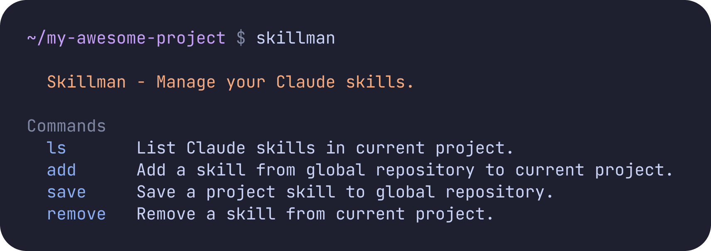

<div align="center">

[](https://github.com/saez-juan/skillman)
[](https://www.python.org)
[](LICENSE)

**A powerful CLI tool to manage Claude Code skills across multiple projects**

[Features](#features) • [Installation](#installation) • [Quick Start](#quick-start) • [Documentation](#usage)

</div>

---

## Why Skillman?

Working with Claude Code across multiple projects? Tired of copying skills manually between projects? **Skillman** solves this by creating a centralized repository for all your Claude skills, with project-specific activation using symlinks.

### The Problem
- Skills scattered across different projects
- Manual copying leads to outdated duplicates
- No easy way to discover which skills you have available
- Difficult to share skills between projects

### The Solution
Skillman uses a **two-tier architecture**:
- **Global Repository** (`~/.claude/skillman/skills`): Your personal library of all available skills
- **Project Skills** (`./.claude/skills`): Active skills in the current project (symlinks only)

**Result**: Skills are stored once, referenced many times. Updates propagate automatically. Zero duplication.

---

## Features

- **Project Isolation**: Each project has its own set of active skills
- **Global Repository**: Centralized storage for all your skills
- **Smart Symlinks**: Automatic symlink creation and management
- **Shell Completion**: Tab completion for commands and skill names (bash/zsh/fish)
- **Save Custom Skills**: Move project-specific skills to your global repository
- **Beautiful CLI**: Rich terminal UI with colors and clear formatting
- **Fast**: Instant scanning and parsing of skill directories
- **100% Test Coverage**: 50 passing tests across all functionality

---

## Installation

### Using Poetry (Recommended)

```bash
# Clone the repository
git clone https://github.com/saez-juan/skillman.git
cd skillman

# Install dependencies
poetry install

# Run skillman
poetry run skillman --help
```

### Using pip

```bash
pip install git+https://github.com/saez-juan/skillman.git
```

---

## Quick Start

```bash
# 1. View your global skills repository
skillman ls --global

# 2. Add a skill to your current project
skillman add setup-ssh

# 3. List active skills in project
skillman ls

# 4. Check what else you can add
skillman ls --available

# 5. Create a custom skill and save it globally
skillman save my-custom-skill
```

### Enable Shell Completion

```bash
# Install bash completion
skillman completion --install

# Add to ~/.bashrc
echo 'source ~/.local/share/bash-completion/completions/skillman' >> ~/.bashrc

# Now enjoy tab completion!
skillman add <TAB>  # Shows available skills
```

---

## Usage

### Listing Skills

```bash
# Show skills active in current project
skillman ls

# Show all skills in global repository
skillman ls --global

# Show skills you can add (available but not active)
skillman ls --available
```

### Managing Skills

```bash
# Add a skill from global repository to project
skillman add <skill-name>

# Remove a skill from current project
skillman remove <skill-name>

# Save a project skill to global repository
# (moves skill to global and creates symlink)
skillman save <skill-name>
```

### Real-World Workflow

```bash
# Scenario: Starting a new project
cd my-new-project

# Check what skills you have available
skillman ls --global
# → setup-ssh, result-pattern, api-client, ...

# Add the ones you need
skillman add setup-ssh
skillman add result-pattern

# Verify they're active
skillman ls
# → setup-ssh, result-pattern

# Later: Create a project-specific skill
mkdir -p .claude/skills/custom-validator
# ... create SKILL.md and implement ...

# Like it? Save it to your global repository
skillman save custom-validator
# ✓ Moved to global repository
# ✓ Created symlink in project

# Now it's available for other projects!
cd ../other-project
skillman add custom-validator
```

---

## How It Works

### Architecture Overview

| Component | Location | Purpose |
|-----------|----------|---------|
| **Global Repository** | `~/.claude/skillman/skills/` | Central storage for all your skills |
| **Project Skills** | `./.claude/skills/` | Active skills in current project (symlinks) |
| **Symlinks** | Project → Global | Automatic links that reference global skills |

### Example Setup

**Global Repository contains:**
- `setup-ssh/`
- `result-pattern/`
- `api-client/`
- `custom-validator/`

**Project A uses:**
- `setup-ssh` → (symlink to global)
- `result-pattern` → (symlink to global)

**Project B uses:**
- `result-pattern` → (symlink to global)
- `api-client` → (symlink to global)

### Key Benefits

- **Single Source of Truth**: Skills stored once in global repository
- **Automatic Updates**: Update global skill → all projects get the update
- **Project Isolation**: Each project references only what it needs
- **Zero Duplication**: No copies, no sync issues
- **Easy Discovery**: `skillman ls --global` shows all available skills

---

## Shell Completion

Skillman includes intelligent tab completion for all shells:

```bash
# Bash
skillman completion --install
source ~/.local/share/bash-completion/completions/skillman

# Zsh (add to ~/.zshrc)
eval "$(_SKILLMAN_COMPLETE=zsh_source skillman)"

# Fish (add to ~/.config/fish/config.fish)
eval (env _SKILLMAN_COMPLETE=fish_source skillman)
```

**What gets autocompleted:**
- `skillman <TAB>` → Available commands
- `skillman add <TAB>` → Skills from global repository
- `skillman remove <TAB>` → Active skills in project
- `skillman save <TAB>` → Non-symlink skills (candidates to save)

---

## Development

```bash
# Install development dependencies
poetry install

# Run tests
poetry run pytest

# Run tests with coverage
poetry run pytest --cov=skillman

# Run specific test
poetry run pytest tests/test_cli.py::TestSaveCommand

# Code formatting (if you want to contribute)
black src/ tests/
```

---

## Requirements

- **Python**: >= 3.8
- **Poetry**: For dependency management (recommended)
- **Git**: For version control

### Dependencies

- `click` ^8.0.0 - CLI framework
- `rich` ^13.0.0 - Beautiful terminal output
- `tomli` ^2.0.0 - TOML parser (Python < 3.11)
- `tomli-w` ^1.0.0 - TOML writer

---

## Project Structure

```
skillman/
├── src/skillman/
│   ├── cli.py           # CLI commands and logic
│   ├── config.py        # Configuration management
│   ├── skills.py        # Skill parsing and discovery
│   └── __main__.py      # Entry point
├── tests/               # 50 tests, 100% passing
│   ├── test_cli.py      # CLI commands
│   ├── test_config.py   # Configuration
│   ├── test_skills.py   # Skill manager
│   └── fixtures/        # Test data
├── assets/              # Images and resources
├── CLAUDE.md            # Claude Code integration guide
└── README.md            # You are here
```

---

## Contributing

Contributions are welcome! Feel free to:
- Report bugs
- Suggest features
- Submit pull requests

---

## License

MIT License - see [LICENSE](LICENSE) file for details.

---

## Author

**Juan Saez**
- GitHub: [@saez-juan](https://github.com/saez-juan)
- LinkedIn: [Juan Saez](https://www.linkedin.com/in/juan-saez)

---

<div align="center">

**Built with ❤️ for the Claude Code community**

Star this repo if you find it useful!

</div>
